# ITCS355 Lab 1 — Reproducible Training

> **Course materials live in [`course/`](course/README.md)** — syllabus, slides, the faculty
> specification, all five lab handouts, and the project brief. Every document is Markdown and
> renders on GitHub, diagrams included. New to the repo? Start with the
> [portability reference](course/reference/cloud-portability-reference.md).
> Keep this block when you edit the rest of this file; it is not part of the Lab 1 deliverable.

Predicting machine failure within 7 days from sensor readings. The model is not the point;
whether a stranger can reproduce it is.

> **This README is graded.** A grader with Docker and nothing else from your setup runs one
> command and compares the result against the claim below. Edit every `<...>` and delete the
> instruction blocks marked **REPLACE** before submitting.

---

## Reproduce

```bash
make reproduce
```

expected test_roc_auc: 0.8493 ± 0.0075

Runtime: about 40 seconds on 4 cores. No cloud account or credentials needed for this command —
that is deliberate, and it is why a grader can run it.

---

## The problem

240 machines, 25 readings each, 6 sensor features, binary target `failed_within_7d` with a
positive rate near 12%.

Machines have persistent characteristics — a hot-running machine reads hot in every row. So the
train/validation/test split is **grouped by `machine_id`**: every reading from one machine lands
in exactly one partition. Splitting row-wise instead lets the model memorise the machine and
reports a validation score that will never survive production. `tests/test_data.py` asserts this
property holds, and Lab 4 turns it into a CI gate.

Bringing your own dataset is allowed. Replace `scripts/make_dataset.py`, update the schema in
`src/data.py`, and keep every test passing.

---

## Layout

```
src/          Layer 1 — provider-neutral. No SDKs, no bucket names, no absolute paths.
cloudlayer/   Layer 3 — the only place a provider SDK may be imported.
scripts/      Dataset generation, cloud check, portability audit, metric verification.
tests/        Data contract tests and split property tests.
```

`src/config.py` is the single point of environment knowledge. Everything else reads from it.
`make portability-audit` enforces the rule; it fails the build if a provider string appears in
`src/` or `tests/`.

---

## Setup

```bash
cp cloud.env.example cloud.env      # fill in, never commit
make setup
make cloud-check                    # eight slots, all PASS
make data                           # generate the dataset
make test                           # 10 tests, all passing
```

Post your `make cloud-check` output in the course channel before Session 1.

---

## What you must finish

Four `TODO` markers are left in the repo deliberately. Each is a graded decision, not busywork.

| Where | What |
|---|---|
| `requirements.txt` | Regenerate with `pip-compile --generate-hashes` |
| `Dockerfile` | Pin the base image by digest; add `--require-hashes` |
| `cloudlayer/<your provider>.py` | Implement `upload`, `download`, `push_image` |
| This README | The reproducibility trade-off question below |

Then:

```bash
make image-push        # image reaches your registry, digest-pinned
dvc init && dvc remote add -d storage ${BLOB_URI}/dvc
dvc add data/raw && dvc push
```

Run five or more tracked runs varying something meaningful — not five identical runs with
different seeds.

---

## Reproducibility trade-off

First of all, I would get rid of the hashed dependencies. Whenever you try to recreate or run the thing again, the use of digest pinned base images and controlled seeds will be
immediately seen as faulty since both a moved tag and an unset seed will appear right away. On the other hand, the absence of hashes does not make itself immediately
apparent in this way; if you republish your wheel with the same version number, your build process will be altered in some quiet way and this will only become noticeable later.

Three things pin your build: hashed dependencies, a digest-pinned base image, and controlled
seeds. Under real time pressure you would keep some and drop others.

Which would you drop first, and what specifically breaks when you do? There is a defensible
answer, and we compare answers in Session 2. An answer that refuses to choose scores zero.

---

## Notes for the grader

requirements.txt was regenerated with pip-compile --generate-hashes; one transitive dependency (greenlet) required an explicit entry in requirements.in since --require-hashes rejects
unpinned transitive packages.
**DVC remote access:** Raw data is versioned in a private Azure Blob Storage container (`itcs355` on account `itcs3556688022`) and requires Azure credentials with
`Storage Blob Data Reader` access to pull via `dvc pull`. This is **not required to reproduce the graded metric** — `make reproduce` regenerates the raw dataset deterministically
from the fixed seed via `scripts/make_dataset.py`, with no dependency on DVC or cloud access.

---

## Checklist before you submit

- [ ] `make reproduce` works from a fresh clone, on a machine that is not yours
- [ ] `make verify` passes against your claim line
- [ ] `make test` — all tests pass
- [ ] `make portability-audit` — clean
- [ ] Image builds for `linux/amd64` and is pushed, digest-pinned
- [ ] `dvc push` completed; a grader can `dvc pull`
- [ ] Five or more tracked runs with params, metrics, data fingerprint, and commit SHA
- [ ] Every **REPLACE** block above is gone (the course-materials block at the top stays)
- [ ] `git log -p | grep -i -E "secret|password|AKIA|BEGIN PRIVATE"` returns nothing

That last check is not optional. A credential in Git history is an automatic deduction in this
course, and rotating it is your responsibility, not the grader's.

---

## Lab 2 — Cloud Training, Model Selection, Registry, and Reproducible Deployment

### Cloud training

The Lab 2 implementation was prepared for Azure ML managed compute using
discounted LowPriority compute. The intended compute was `Standard_DS3_v2`
with `low_priority` tier.

The workspace could not provision the required compute under the available
Azure for Students subscription. The `lab2-lowpri` compute failed with
`ClusterMinNodesExceedCoreQuota`. Azure reported that the subscription had
0 vCPUs available to Azure ML managed compute.

To verify that the failure was not specific to the DS3_v2 instance size, a
second LowPriority compute using `Standard_D2s_v3` (2 vCPUs) was also created.
It failed with the same `ClusterMinNodesExceedCoreQuota` error, reporting that
the subscription's total vCPU quota was 0.

The Azure Portal also rejected a quota-increase request because the current
subscription is not eligible for a quota increase without upgrading to
Pay-As-You-Go. I did not upgrade the subscription because this would introduce
a billing requirement unrelated to the lab.

Therefore, the remaining cloud-training work is blocked by the subscription's
Azure ML compute quota rather than by the training implementation.

Evidence:

- `lab2-lowpri` — `Standard_DS3_v2`, LowPriority — provisioning failed with
  `ClusterMinNodesExceedCoreQuota`.
- `lab2-lowpri-d2` — `Standard_D2s_v3`, LowPriority — provisioning failed with
  `ClusterMinNodesExceedCoreQuota`.
- Azure CLI reported `lowPriorityCores` quota of 3 for the region, but Azure ML
  managed compute reported a total vCPU quota of 0.
- Azure Portal quota request was rejected because the Azure for Students
  subscription is not eligible for a quota increase.
- Quota-request trace ID:
  `048fc0e0-68d6-433e-a432-42db5e788a8e`

The required discounted-compute rerun should therefore be performed in a
course-provided Azure subscription/workspace with sufficient Azure ML compute
quota if one is made available.

The 12-trial sweep and seed reruns were run on Dedicated Standard_DS3_v2 compute; the corresponding execution evidence is preserved under azure_trial_metrics/.

The current training adapter enforces LowPriority compute for new Lab 2 submissions; the historical Dedicated runs above were completed before this guard was added and are retained as experimental evidence because the required LowPriority compute could not be provisioned.

### Initial permission failure

The first remote training submission used the compute managed identity `9144aef5-...`. It already had `Storage Blob Data Contributor` on the storage account, but was missing `AcrPull` on the `itcs3556688022` container registry. The job therefore could not pull the training image. Adding `AcrPull` to the compute identity resolved this permission failure.

### Trials
The 12 actual Azure ML experiments were done on 3 hyperparameters to achieve:
`n_estimators`, `max_depth`, and `min_samples_leaf`. The total cost was roughly 2.91 THB, well within the budget of 150 THB.

### Selection
Selected config: `n_estimators=100, max_depth=4, min_samples_leaf=5`. It was
re-run across 3 seeds to check stability:

| Seed | Val ROC-AUC | Val PR-AUC | Test ROC-AUC |
|---|---|---|---|
| 20260101 | 0.8426 | 0.3932 | 0.8533 |
| 20260102 | **0.8733** | **0.4718** | 0.8463 |
| 20260103 | 0.8430 | 0.3909 | 0.8318 |

Seed 20260102 was chosen because it had the highest validation ROC-AUC of the three seed reruns, and validation performance is used for choosing the model; the test set is kept held-out. Even though seed 20260101 had a slightly better score on the test set, using the performance on the test set for choosing the model leaks information about the held-out data.

The cost of the 12 trial study was about 2.91 THB which is obviously less than the budgeted 150 THB. This is equivalent to an average of approximately 0.24 THB per trial. One monthly retrain is about 0.24 THB by that average, an estimate rather than a verified Azure bill.

One way this choice could be wrong is that the seed also reseeds
`make_dataset.py`, so the three runs vary both model randomness and the
underlying data — the observed variance does not isolate model-seed variance
alone. This same configuration scored 0.8426 in the original 12-trial sweep
(default seed), versus 0.8733 with seed 20260102 and 0.8430 with seed 20260103.
Seed-driven variation is therefore large relative to the differences observed
across the original sweep, so the sweep alone does not establish a reliably
superior configuration.

### Lineage
| Item | Value |
|---|---|
| Git commit | `6ccc5ee0e89d624811802e869f5e4099d1707776` |
| Data version | Generated dataset: `make_dataset.py --seed 20260102` |
| Data fingerprint | `3ae9705eb3f197a3` |
| MLflow run ID | `a81deea37f9b4659addf64908d518e7b` |
| Training job | `mango_boot_pbpr17lrhb` |
| Image digest | `sha256:585f50972aa5afd104c6b337fd23716a82276cb9b6a5401d7f8a0dbaf64a0d7a` |
| Seed | `20260102` |
| Val / Test ROC-AUC | `0.8733` / `0.8463` |

### Registry
Registered as `itcs355-6688022:2` with the lineage above as tags, plus
`stage=staging`. As the installed Azure ML SDK (azure-ai-ml 1.35.0) lacks a public native stage-promotion API for the workflow process, the lab staging state is expressed via the stage=staging model tag.

The registered model was trained from the seed-20260102 generated dataset,
with fingerprint 3ae9705eb3f197a3. The MLflow run a81deea37f9b4659addf64908d518e7b
is no longer available with its original container, but the Azure job
mango_boot_pbpr17lrhb and its preserved execution evidence are available under
azure_trial_metrics/.

### Promotion policy
Promotion of the ML model should be done by the ML engineer or release owner, and not all developers who are capable of training ML models. It will be the responsibility of the reviewer to demand proof of a reproducible lineage for the registered model before it is promoted, and these include: Git commit, data version, MLflow run ID, training job ID, container image digest, seed, and validation/test metrics. The selected model should have documented evaluation against the candidate configurations and a successful reload check from the model registry.

### Reload check
`reload_check.py` downloaded `itcs355-6688022:2` directly from the registry,
deserialized it, and scored 5 held-out rows — **PASS**.

**Known limitation:** `reload_check.py` splits the data with `seed=20260101`,
while the registered model was trained using data generated with
`seed=20260102`. This proves the registry-to-inference path works but is not an
exact reproduction of the original evaluation split.

To run the Azure ML registry reload check, the environment must provide
`AZURE_SUBSCRIPTION_ID`, `AZURE_RESOURCE_GROUP`, and `AZURE_ML_WORKSPACE`.

Run:

```bash
make reload-check VERSION=2
```

### Known limitations
- The local MLflow file store did not persist beyond each ephemeral container;
  Azure job logs/artifacts were used to recover completed-run metrics.
- The reload-check data split seed does not match the registered model's
  training-data seed.

### Checkpoint and interruption evidence

The remote tuning controller checkpoints study state after each trial and
skips completed trials when restarted. The checkpoint/resume behavior was
tested locally: a completed trial was recovered after restarting the
controller, and a separate running-process test was interrupted with
`Ctrl-C` while the checkpoint file remained intact. If the controller is interrupted while waiting for an Azure ML job, the submitted job is not automatically cancelled. A restart can therefore resubmit the interrupted configuration. A production controller should reconcile or cancel the in-flight job before resubmission to avoid duplicate work and cost.

The interruption evidence is preserved in
`reports/interrupt-resume-log.txt`. It records the checkpoint surviving the
local `Ctrl-C` interruption and the subsequent resume behavior. The resume test then confirmed that
the completed trial was skipped and a subsequent trial could be recorded.

An actual Azure ML LowPriority interruption could not be demonstrated because
the required LowPriority compute could not be provisioned under the available
Azure for Students quota.

---

## Lab 3 — Serving, Load Testing, Canary/Rollback, and Cost

Lab 3 covers reproducible model serving, containerisation, health and readiness checks, percentile-based load testing, batch inference, payload-size experiments, canary deployment, rollback, and serving-cost analysis.

The implementation uses **Azure Container Apps for serving** rather than Azure ML managed online endpoints. This is intentional for the Azure for Students environment and avoids depending on Azure ML managed-online-endpoint quota.

### Serving

The FastAPI service exposes four endpoints:

| Endpoint              | Purpose               |
| --------------------- | --------------------- |
| `POST /predict`       | Single prediction     |
| `POST /predict/batch` | Batch prediction      |
| `GET /health`         | Liveness check        |
| `GET /ready`          | Model readiness check |

The model is loaded during application startup rather than once per request. Prediction responses include the deployed model version.

Run the service locally with:

```bash
make serve
```

Export the model used by the local service with:

```bash
python scripts/export_model.py --out reports/model.joblib
```

Build the serving image with:

```bash
make serve-image VERSION=2
```

The serving image is explicitly built for `linux/amd64`:

```bash
docker buildx build --platform linux/amd64 ...
```

This allows the same image architecture to be used in the deployment environment when development is performed on an Apple Silicon Mac.

### Local container verification

The serving image was successfully run locally with:

```bash
docker run --rm \
  -p 8080:8080 \
  -e MODEL_PATH=/app/model/model.joblib \
  -e MODEL_VERSION=2 \
  itcs355-serve:05c7001
```

The service successfully loaded the model:

```text
model loaded, version=2
```

The health and readiness endpoints returned successful responses:

```json
{"status":"alive"}
```

and:

```json
{"status":"ready","model_version":"2"}
```

A real prediction was also successfully executed:

```json
{"probability":0.03348807896248448,"model_version":"2"}
```

The corresponding service log recorded the `/predict` request as HTTP 200 with approximately 66 ms latency.

The Docker image targets `linux/amd64`, so Docker may report a platform warning when it is executed directly on an Apple Silicon development machine. This is expected because the deployment image was deliberately built for the target cloud architecture.

### Deployment

The repository's deployment seam is provider-adapted through `cloudlayer/`.

Build and push the serving image with:

```bash
make serve-image-push
```

Deploy the registered model with:

```bash
make deploy VERSION=2
```

Run a smoke test with:

```bash
make smoke
```

The deployment uses **Azure Container Apps** and the registered model version is used as the deployment model reference.

The provider-specific deployment details are isolated in `cloudlayer/azure.py`, while the FastAPI serving implementation remains provider-independent.

### Health versus readiness

`/health` and `/ready` intentionally represent different concepts.

`/health` answers whether the service process is alive.

`/ready` answers whether the service is ready to serve predictions, including whether the model has successfully loaded.

Therefore, a service can be alive while not yet ready. A deployment system should use readiness rather than liveness when deciding whether a new instance should receive traffic.

### Load testing

The p95 latency target was declared **before measurement**:

```text
p95 < 200 ms
```

The target is encoded directly in `loadtest/k6.js`:

```javascript
'predict_latency_ms': ['p(95)<200']
```

The load-test implementation records percentile latency rather than relying only on mean latency.

Run the standard load test with:

```bash
make loadtest TARGET=https://<endpoint>/predict
```

The k6 implementation supports concurrency, batch requests, and payload-size experiments.

Load-test evidence is preserved in:

* `reports/lab3-load.md`
* `reports/lab3-report.md`

### Concurrency results

The authenticated load-test series produced:

| VUs | Requests | Throughput (req/s) | p50 (ms) | p95 (ms) | p99 (ms) | Error rate |
| --: | -------: | -----------------: | -------: | -------: | -------: | ---------: |
|   1 |      365 |               6.08 |    146.0 |    233.0 |    236.4 |      0.00% |
|   2 |      627 |              10.43 |    186.0 |    258.0 |    269.9 |      0.00% |
|   3 |      765 |              12.69 |    236.4 |    302.5 |    332.9 |      2.09% |
|   5 |    1,611 |              26.75 |    239.7 |    302.0 |    333.8 |     52.57% |

The first tested concurrency level exceeding the 1% error threshold was **3 VUs**.

The 1- and 2-VU runs produced no failed requests, although their p95 latency was above the pre-declared 200 ms target.

At higher concurrency, reliability degraded. The 5-VU run produced substantial failures, including Azure HTTP/2 `INTERNAL_ERROR` responses.

These results establish the observed serving behaviour under the tested deployment rather than claiming that the 200 ms target was achieved.

### Batch inference

The k6 script also supports batch inference.

For a 100-row batch:

```bash
k6 run \
  -e TARGET=https://<endpoint>/predict/batch \
  -e VUS=1 \
  -e BATCH=true \
  -e BATCH_SIZE=100 \
  loadtest/k6.js
```

The recorded batch experiment produced:

* Batch size: 100
* Batch requests: 357
* Predictions processed: 35,700
* Batch request throughput: 5.9496 batches/s
* Prediction throughput: approximately 594.96 predictions/s
* Batch p50: 140.8 ms
* Batch p95: 265.8 ms
* Batch p99: 461.0 ms
* Batch errors: 0%

Batch inference therefore substantially increased prediction throughput compared with individual prediction requests, although individual batch-request latency exceeded the 200 ms p95 target.

### Payload-size experiment

The load-test script supports payload-size experiments while keeping the prediction features unchanged.

The recorded results were:

| Payload | Requests | p50 (ms) | p95 (ms) | p99 (ms) | Error rate | Throughput (req/s) |
| ------: | -------: | -------: | -------: | -------: | ---------: | -----------------: |
|    1 KB |      444 |    124.6 |    164.2 |    220.2 |         0% |               7.40 |
|   10 KB |      426 |    129.8 |    212.2 |    266.9 |         0% |               7.09 |
|  100 KB |       53 |    941.4 |  2,029.3 |  2,349.3 |         0% |               0.88 |
|  500 KB |       87 |    521.9 |  1,384.1 |  1,578.7 |         0% |               1.43 |

The 1 KB payload met the pre-declared p95 target.

At 10 KB, p95 slightly exceeded the target.

The 100 KB and 500 KB payloads caused substantial latency and throughput degradation despite returning successful HTTP responses.

This demonstrates that unnecessarily large request payloads can become a serving bottleneck even when the inference application itself continues returning successful predictions.

### Canary and rollback

The intended Lab 3 canary workflow is to deploy a second revision and route a controlled percentage of traffic to it, for example:

```text
blue: 90%
green: 10%
```

The repository contains the canary/rollback implementation for this workflow.

However, the Azure Container Apps environment available for this deployment is an **Express environment**. Express environments do not support switching from single active revision mode to multiple active revision mode.

The attempted revision-mode change failed with the exact Azure error:

```text
(ExpressEnvironmentFeatureNotSupported)
'Not Single Active Revisions Mode' is not supported on express environments.
```

Therefore, a **concurrent 90/10 traffic split between two active revisions could not be performed in this environment**.

This is an Azure Container Apps platform restriction rather than an application or FastAPI implementation error. It cannot be solved by changing the prediction service code.

Consequently, the repository should not claim that a true concurrent 90/10 blue/green split was successfully achieved in this Express environment.

The canary/rollback helper remains in the repository because it implements the intended deployment workflow and can be used in an Azure Container Apps environment that supports multiple active revisions.

### Cost

Serving cost is estimated using the measured serving throughput, the instance hourly rate, and an assumed utilisation level.

The project uses the following cost model:

```text
cost = hourly_rate × (1000 / (throughput × utilisation)) / 3600
```

The current `Standard_DS2_v2` pricing estimate is approximately:

```text
11.1955 THB/hour
```

The previous measured DS2_v2 throughput used for the cost calculation was:

```text
6.671472 predictions/s
```

The estimated cost per 1,000 predictions is:

| Utilisation | THB / 1,000 predictions |
| ----------: | ----------------------: |
|          5% |                  9.3229 |
|         25% |                  1.8646 |
|         80% |                  0.5827 |

The 80% utilisation figure is used as the primary estimate, while the other utilisation levels are shown because utilisation is an important assumption for a continuously running serving instance.

The cost analysis also considers the advantage of batching: batch inference can process substantially more predictions per second, which can reduce the compute cost per prediction when the application's latency requirements allow batching.

The detailed cost analysis is documented in:

```text
reports/lab3-report.md
```

An additional cost-report artifact is retained at:

```text
reports/lab5-cost.md
```

This file originates from the supplied scaffold and contains the project's cost-report calculations. It is retained as supporting cost information; the authoritative Lab 3 cost analysis is `reports/lab3-report.md`.

### Teardown

Lab 3 resources should not be left running after testing.

Use:

```bash
make teardown
```

The teardown implementation uses the Lab 3 resource tags so that resources created for the exercise can be removed without manually tracking every generated resource name.

### Validation

The final automated test suite passes:

```text
34 passed, 1 warning
```

The warning is a dependency deprecation warning and does not cause the test suite to fail.

The serving container was also manually tested through:

```text
GET  /health
GET  /ready
POST /predict
```

All returned successful responses during the local container verification.

### Lab 3 evidence

The main Lab 3 evidence files are:

```text
reports/lab3-report.md
reports/lab3-load.md
loadtest/k6.js
service/Dockerfile.serve
cloudlayer/azure.py
scripts/canary_roll.py
Makefile
```

The repository therefore provides evidence for:

* FastAPI model serving
* model loading during startup
* health and readiness checks
* single prediction
* batch prediction
* containerisation
* `linux/amd64` serving-image construction
* pre-declared p95 latency target
* concurrency testing
* percentile latency measurements
* error-rate measurements
* batch-throughput measurements
* payload-size experiments
* serving-cost analysis
* deployment and teardown logic
* attempted canary/multiple-revision deployment

The main limitation is the Azure Container Apps Express environment's inability to support multiple active revisions. This prevented the intended concurrent 90/10 canary traffic split, and the exact Azure platform error is preserved above.

### Conclusion

Lab 3 successfully demonstrates the provider-independent serving workflow, containerised model inference, health and readiness checks, single and batch inference, percentile-based load testing, payload-size experiments, deployment, cost analysis, and teardown.

The experiments also establish important serving limitations. The declared p95 target of 200 ms was not met by the later authenticated baseline measurements, and reliability degraded beyond the tested 2-VU range. Batch inference substantially increased prediction throughput, while unnecessarily large payloads substantially increased latency.

The intended concurrent canary traffic split could not be completed because the available Azure Container Apps Express environment does not support multiple active revisions. The exact platform error was:

```text
(ExpressEnvironmentFeatureNotSupported)
'Not Single Active Revisions Mode' is not supported on express environments.
```

This limitation is documented explicitly rather than presenting an unsupported 90/10 canary as successfully completed.


---

## Lab 4 — CI/CD, Observability, and Drift

Lab 4 turns the commit-to-deployment path into an automated pipeline, instruments the running service, and proves that the checks work by breaking things on purpose. Everything below is backed by a screenshot or a log under `docs/lab4/`. Where the Azure for Students subscription or the university tenant blocked the intended approach, the substitution and its justification are listed in [Substitutions and limitations](#substitutions-and-limitations).

| Deliverable | Status | Evidence |
|---|---|---|
| Unit, data-contract, model-behaviour and integration tests | Done | `tests/`, CI run below |
| CI: lint, tests, build, integration test, images tagged by commit SHA | Done | [CI run](https://github.com/ruboon-dej/lab1-itcs355/actions/runs/37764248231) |
| CD to staging, main only, only after green CI, no stored Azure key | Done, with one substitution (S6) | [CD run](https://github.com/ruboon-dej/lab1-itcs355/actions/runs/37764818678) |
| Blocked bad commit | Done | [PR #6](https://github.com/ruboon-dej/lab1-itcs355/pull/6), [failing run](https://github.com/ruboon-dej/lab1-itcs355/actions/runs/37796025255) |
| Dashboard with the five required signals | Done, local (S3) | screenshots below |
| SLO with target, window and error-budget response | Done | `monitoring/slo.yaml` |
| Scheduled drift detector, justified threshold, alert to a channel I see | Done, with substitutions (S2, S4) | [Drift detection](#drift-detection-task-5) |
| Injected drift: alert, timestamps, detection time | Done: on-demand measured; scheduled run did not fire (see finding) | [Injected drift](#injected-drift-exercise-task-6) |
| Five-line post-mortem | Done | below |
| Teardown | Done | [Teardown](#cost-and-teardown) |

### 1. Tests (Task 1)

Four categories, run cheapest first in CI so a schema mistake fails in seconds rather than after a build.

| Category | Tests | Production incident the test would have caught |
|---|---|---|
| Data contract | `test_schema_columns_present_and_typed` | an upstream team renames, drops or retypes a column |
| Data contract | `test_no_nulls_in_required_columns` | a sensor outage or a broken join starts filling features with nulls |
| Data contract | `test_features_within_plausible_ranges` | a unit change (°C to °F) or a stuck sensor |
| Data contract | `test_target_is_binary_and_not_degenerate` | the labelling job breaks and every row gets the same label |
| Data contract | `test_identifier_is_unique` | a duplicated ingestion batch |
| Data contract | `test_no_machine_leaks_across_splits` | leakage: one machine in both train and test inflates the metric |
| Model behaviour | `test_predictions_are_valid_probabilities`, `test_known_healthy_machine_scores_low`, `test_risk_increases_with_wear`, `test_model_is_not_constant` | a retrained model that is broken but still "passes" the headline metric |
| Model behaviour | `test_prediction_latency_within_budget` | a model change that makes inference too slow |
| Service / observability | `tests/test_service.py`, `tests/test_metrics.py` | `/predict` or `/metrics` breaking, and 4xx errors being counted as 5xx |
| Integration | CI builds the serving image, starts the container, calls `/predict` and checks the response and model version | an image that builds but does not serve |

The latency budget is 50 ms per single prediction. It is a quarter of the 200 ms p95 target in `loadtest/k6.js`, which leaves the rest for network, JSON handling and queueing. Inference measures about 5 ms here, so there is roughly ten times headroom for a slow CI runner.

### 2. CI/CD pipeline (Task 2)

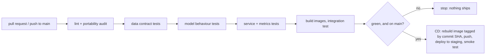

- `ci.yml` runs on every pull request and on pushes to main. Documentation-only pushes to main (README, `docs/`, `reports/*.md`, `reports/*.txt`) are skipped, because CD follows CI and would otherwise redeploy staging after a pure text change.
- `cd.yml` starts only when CI succeeded on main and runs only through the `staging` GitHub environment. It checks out the exact commit CI tested, rebuilds the serving image tagged with that commit SHA (never `latest`), pushes it, deploys to Azure Container Apps (environment `itcs355-itcs355-6688022-cae`) and runs a smoke test: three known payloads, each of which must return a probability in [0, 1] and a `model_version` equal to the commit SHA.

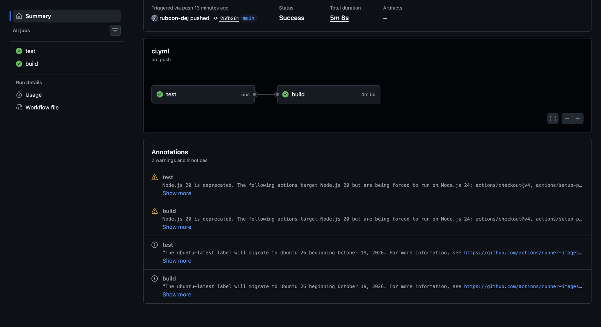

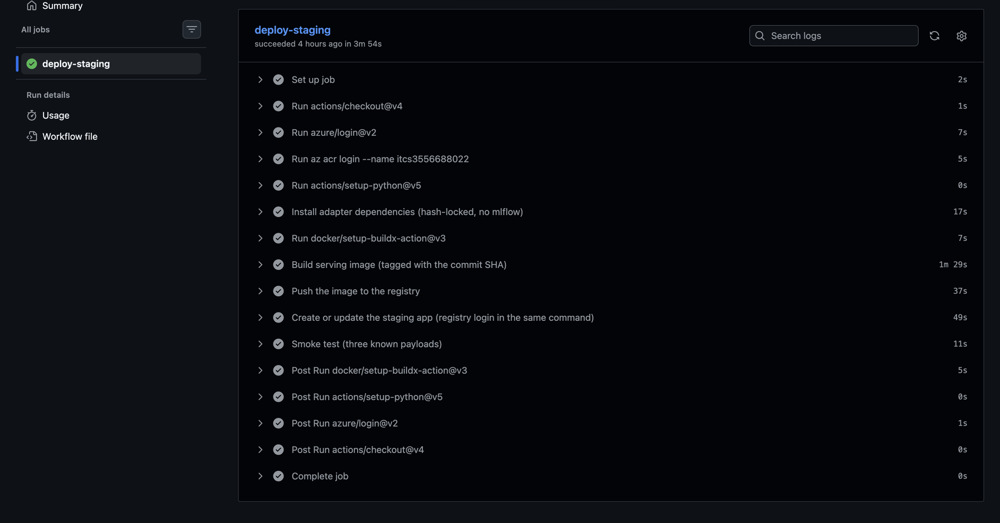

**Credentials, no stored key.** CD logs in to Azure with OIDC federation. The usual route needs an Entra app registration, and `az ad app create` fails in the university tenant with `Insufficient privileges`. I used a user-assigned managed identity (`itcs355-gh-deploy`) with a GitHub federated credential instead, with `AcrPush` on the registry and `Contributor` on the resource group only. The first login failed with `AADSTS700213: No matching federated identity record`: GitHub now presents the repository by numeric ids (`repo:ruboon-dej@72783235/lab1-itcs355@1359732448:environment:staging`), so the credential subject has to use that form.

**Why CD does not call `adapter.deploy()`.** That method creates the app with a public image, saves the registry login in a separate command, then switches to the private image. In this subscription the app's registry list stayed empty (`registries: null`) and Azure refused the pull with `Authentication failed when pulling container image ... Provide registryCredentials or managedIdentityClientId`. Controls I ran: the registry admin credentials returned HTTP 200 and could read the image; my Lab 3 `regtest` app in the same environment ran the same registry and credentials fine; and a throwaway app created with the registry login inside `az containerapp create` pulled the image successfully. I did not find out why the separate step does not persist. CD therefore creates the app with the login inside the create command (and recreates the staging app if an in-place update fails, since staging is disposable).

### 3. Blocked bad commit (Task 3)

[PR #6](https://github.com/ruboon-dej/lab1-itcs355/pull/6) renames one column in `scripts/make_dataset.py` (`vibration_mm_s` to `vibration_mm_sec`). The [CI run](https://github.com/ruboon-dej/lab1-itcs355/actions/runs/37796025255) failed at "Data contract tests": `test_schema_columns_present_and_typed` fails with `missing columns: ['vibration_mm_s']`, and two more tests fail with `KeyError` because the column is gone (3 failed, 7 passed). The behaviour tests, the service tests and the image build were skipped, and GitHub shows "This branch has not been deployed". No CD run exists for the PR. The PR was closed without merging.

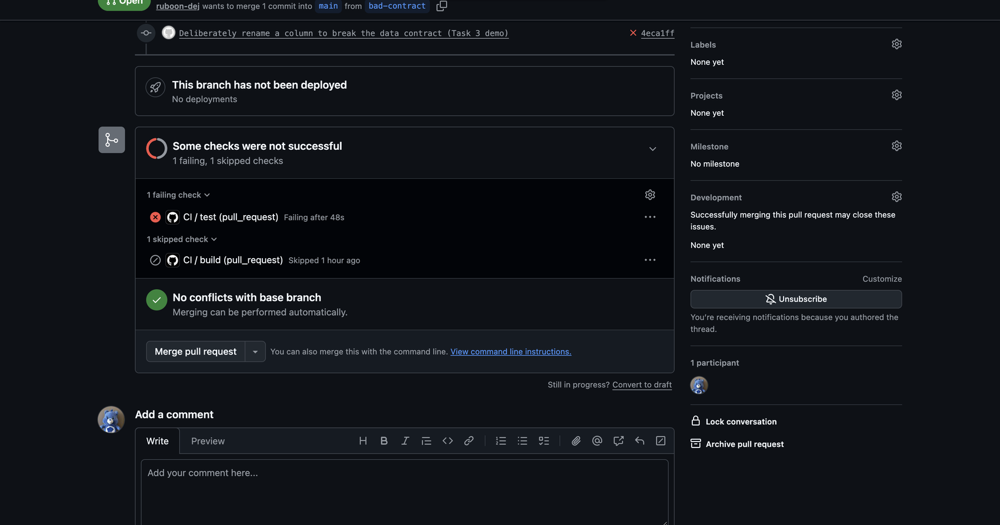

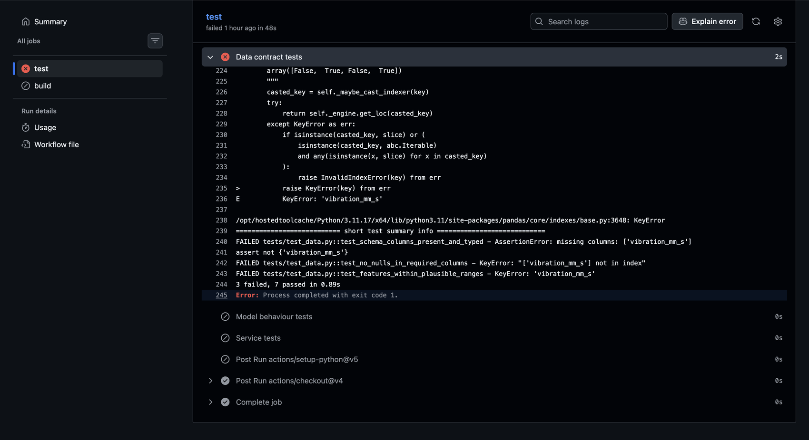

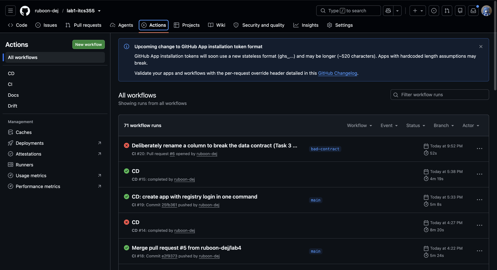

### 4. Dashboard (Task 4)

Prometheus and Grafana run locally (`docker compose -f monitoring/docker-compose.yml up -d`); the dashboard is code. `monitoring/dashboard.json` is the single source and `scripts/build_grafana_dashboard.py` generates the Grafana file. The service exposes `/metrics`: request counts split by 4xx and 5xx, a latency histogram, the model version, and the rolling mean of every input feature over the last 500 requests.

| Required signal | Panel |
|---|---|
| Request rate | "Request rate" |
| Error rate split 4xx / 5xx | "Error rate by class" |
| Latency p50, p95, p99 | "Latency p50 / p95 / p99" |
| Feature-distribution statistic over a rolling window | "Input rolling mean: temp_c (last 500 requests)" |
| Model version in production | "Model version in production" |
| Drift (extra) | "Feature drift (PSI per feature)" |

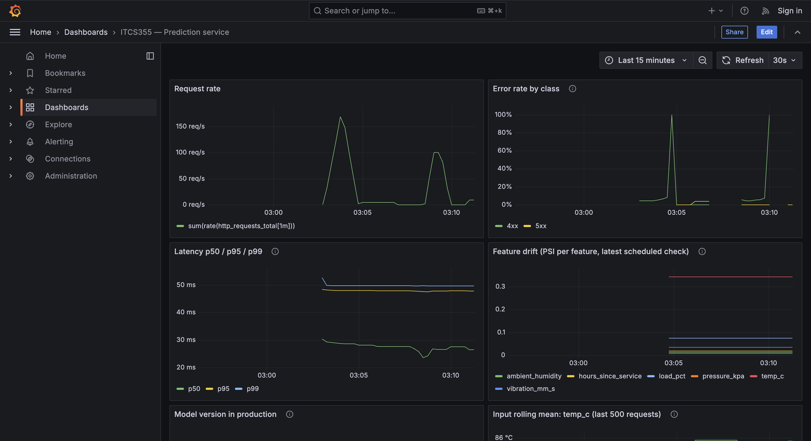

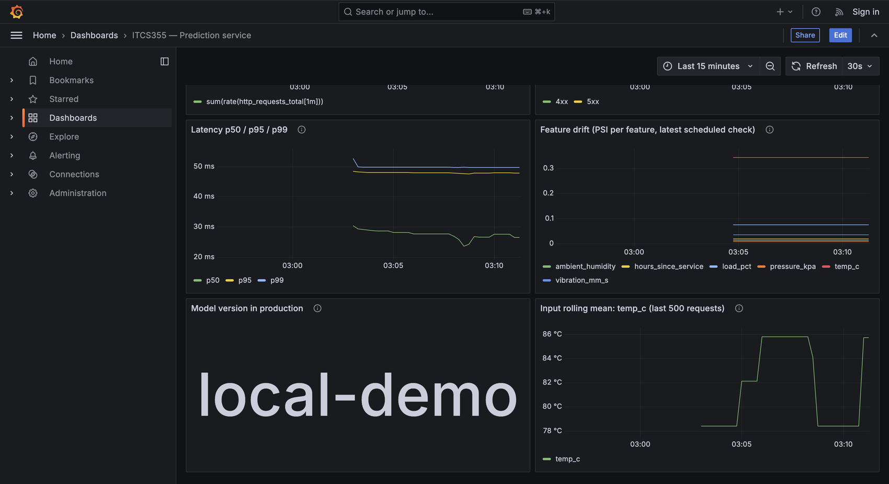

How to read it. The 4xx line reaches 100% only in the gaps between load tests, when my deliberately malformed requests were the only traffic; during the k6 runs it sits near 5%. The latency percentiles come from histogram buckets, so p95 reads higher (about 48 ms) than the exact 35 ms k6 reports. The steps and the drop in the `temp_c` rolling mean are two replays of 500 shifted rows with a normal k6 run between them, which refilled the window with normal traffic. The PSI points come from `monitoring/drift.py --pushgateway`. Bugs I found in the starter dashboard and fixed: the error-rate query divided a labelled series by an unlabelled one, so it always returned no data (it now uses `on() group_left`), and the version panel showed the metric value `1` instead of the version label.

### 5. SLO

`monitoring/slo.yaml` sets three objectives, each with a response when the budget is spent.

| Objective | Target | When the budget is spent |
|---|---|---|
| Availability | 0.99 over 30 days. Not higher: the app runs one replica scaling to zero, so a higher promise is one the architecture cannot keep. | Freeze deploys except fixes. If the burn followed a deploy, redeploy the previous SHA-tagged image. Otherwise raise the replica counts and accept the cost. If 0.99 still cannot hold, revise the target in writing. |
| Latency | p95 under 200 ms (matches `loadtest/k6.js`). Honest status: Lab 3 measured 233 ms at 1 VU, so this objective is **not currently met**. | Compare p95 with p99 to separate cold starts from general slowness, raise CPU, re-run the load test, and only then revise the target with a recorded reason. |
| Freshness | Model no older than 30 days | Retrain, but only after the drift post-mortem check; the Lab 5 retraining trigger must fire at or before 30 days. |

### Drift detection (Task 5)

`monitoring/drift.py` computes PSI and KS per feature against the training reference and exits with code 2 when any feature exceeds the threshold. `.github/workflows/drift.yml` runs it on a schedule and on demand. The "recent window" is simulated: 500 fresh rows from the same generator with a different seed per run, optionally with an injected shift (S5). Each score goes to Azure Monitor as `drift.psi.<feature>`; a breach posts to a Discord channel and fails the run, which makes GitHub email me too. A repository variable `DRIFT_ENABLED` is a kill switch for scheduled runs.

**Threshold 0.09, with a reason.** A threshold copied from a tutorial says nothing about my feature volumes, and PSI is biased upward on small windows. `scripts/calibrate_drift_threshold.py` generated 200 fresh datasets from the same process, took 500-row windows, and computed PSI against the reference for all six features. The detector alerts when any feature crosses the line, so the relevant statistic is the maximum across features in each trial: median 0.046, 99th percentile 0.0895, rounded up to 0.09 (`monitoring/drift_threshold.json`). That allows about one false alarm per 100 checks. The conventional 0.10 and 0.25 come from credit scoring with large stable volumes; at this window 0.25 would miss real shifts. On a 500-row window:

| Injection into `temp_c` | PSI | Alert at 0.09? |
|---|---|---|
| none | 0.041 | no |
| shift +1 | 0.055 | no |
| shift +3 | 0.122 | yes |
| shift +6 | 0.344 | yes |
| spread x1.5 | 0.273 | yes |
| spread x2 | 0.525 | yes |
| mix of machines | `temp_c` 0.046; `hours_since_service` and `load_pct` alert instead | yes |

The mix change is the hard one: the fleet changed, not a sensor, and a single-feature view of `temp_c` would have missed it.

**The scores reach Azure Monitor.** Query of the Application Insights workspace (`AppMetrics`, `drift.psi.temp_c`), one reading per drift run:

```text
TimeGenerated (UTC)           psi      run
2026-10-08T20:38:08Z          0.50491  #2 manual, shift +6
2026-10-08T21:30:04Z          0.01722  #3 scheduled, no injection
2026-10-09T01:20:22Z          0.05981  #4 scheduled, no injection
2026-10-09T03:45:57Z          0.30588  #5 manual, shift +6
2026-10-09T07:35:07Z          0.03742  #6 scheduled, no injection
```

### Injected drift exercise (Task 6)

I injected a +6 °C shift in `temp_c` (mean about 80 to 86). Both alerts reached the Discord channel I use; the run log shows the PSI table, `metrics accepted by the cloud provider`, and the alert.

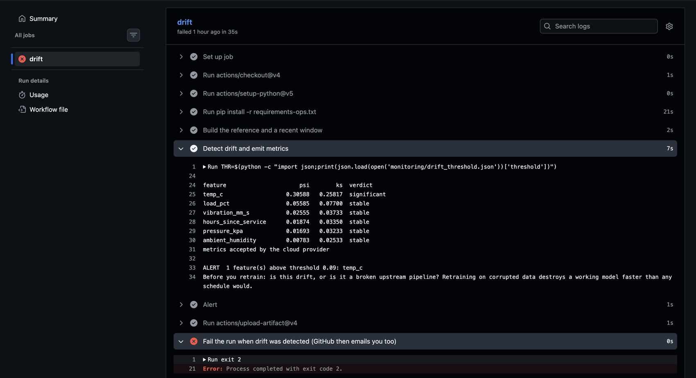

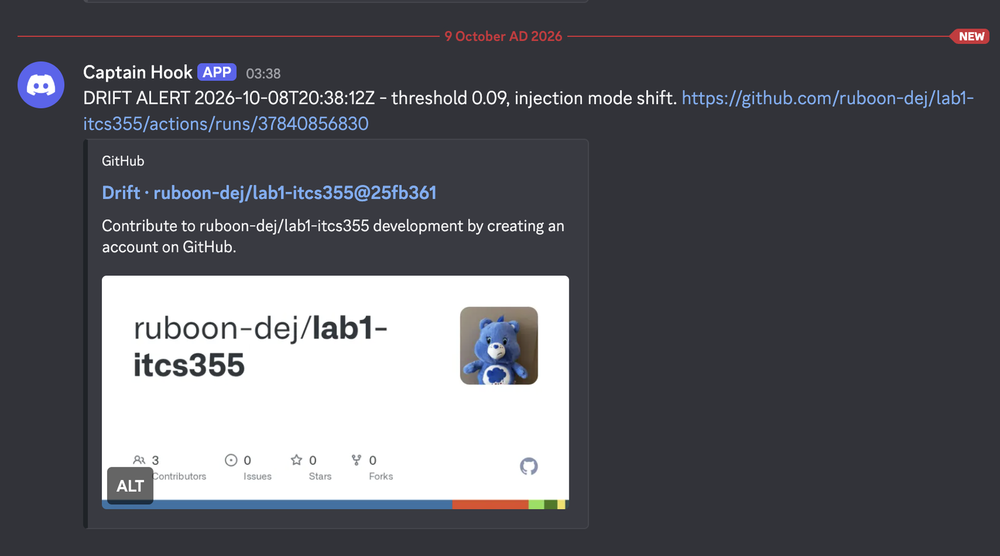

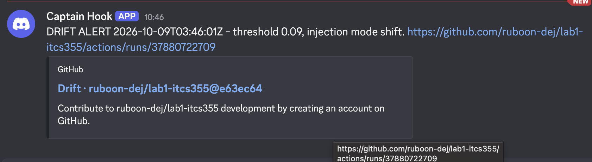

| Run | Trigger | Started (local, UTC+7) | Injection | `temp_c` PSI | Alert |
|---|---|---|---|---|---|
| #1 | schedule | Oct 8, 23:39 | n/a | n/a | skipped by the kill switch (`DRIFT_ENABLED` was not yet set) |
| [#2](https://github.com/ruboon-dej/lab1-itcs355/actions/runs/37840856830) | manual | 03:37 | shift +6 | 0.505 | Discord at 03:38:12 |
| #3 | schedule | 04:29 | none | 0.017 | green |
| #4 | schedule | 08:19 | none | 0.060 | green |
| [#5](https://github.com/ruboon-dej/lab1-itcs355/actions/runs/37880722709) | manual | 10:45 | shift +6 | 0.306 | Discord at 10:46:01 |
| #6 | schedule | 14:34 | none | 0.037 | green |

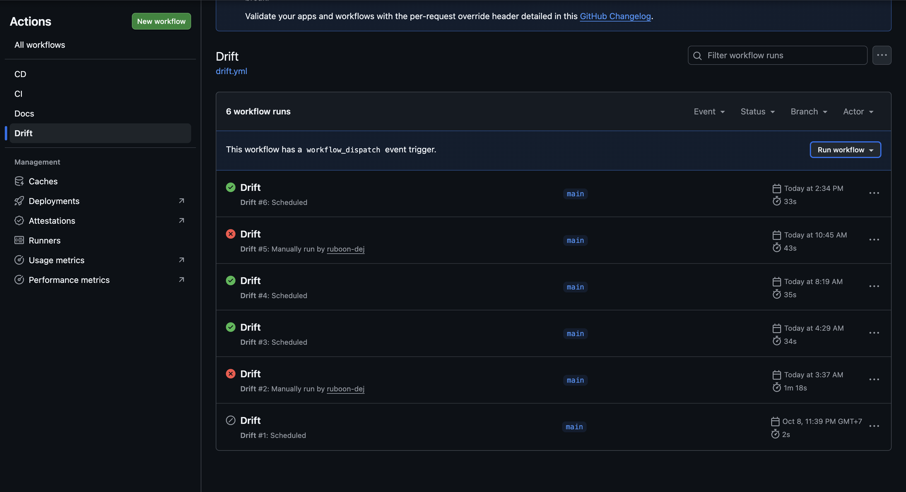

**Detection time, measured two ways.**

- **On demand:** about 45 to 70 seconds from the start of a run to the Discord message (run #5 about 45 s, run #2 about 70 s, including roughly 20 s of dependency installation). This is the speed of the detector itself.
- **On the schedule:** the cron asks for every 15 minutes, but GitHub started the scheduled runs at 04:29, 08:19 and 14:34, gaps of 3 h 50 min and 6 h 15 min. I then switched the shift on with the schedule enabled (after 15:33; I did not record the exact time) and watched for a scheduled run. None had started by 21:09, so the scheduled detection time is **more than 5 hours 30 minutes and was not observed**. GitHub treats scheduled workflows as best-effort, so a 15-minute schedule on GitHub Actions cannot be relied on. A real deployment needs a proper scheduler (Azure Container Apps Job, Azure ML schedule or another cloud timer), which my subscription could not provide (S2).
- **False alarms:** none. The three scheduled runs on unchanged data scored 0.017, 0.060 and 0.037, all under 0.09.

**Five-line post-mortem**

```
What fired: PSI alert on temp_c: PSI 0.31 to 0.50 (KS 0.26 to 0.32) against the 0.09 threshold; the other five features stayed below PSI 0.06.
True cause: the exercise's injected +6 °C shift in temp_c (mean about 80 to 86) from scripts/inject_drift.py. A simulated sensor offset, not a real event. Only values changed, so schema and null rates were unchanged.
Retrain, roll back, or no action: No retrain, no rollback. One feature moved and five are stable, which points to a single source (sensor calibration, a unit change, an upstream bug) rather than a changed world. Retraining on it would bake the offset into the model, so first confirm with the data's producer, and retrain only if the shift is real and persists. Measured impact is small: AUC is unchanged (0.860 to 0.859).
What this would have cost if unnoticed for a week: Ranking quality is unchanged, but the model over-predicts risk: mean predicted failure probability rises 13% (0.115 to 0.129), and 19% more machines are flagged at p >= 0.3 (53 to 63 per 500 readings, about one extra unnecessary inspection per 50 readings). Measured with the registered model on one simulated 500-row window. Assuming 1,000 readings a day (7,000 a week), that is roughly 140 extra inspections a week.
How to prevent or detect it faster: check every incoming batch instead of relying on a timer that can lag by hours, add a per-feature range and null check on production inputs so pipeline breakage is told apart from real drift, and send alerts that name the sensor and its owner.
```

### Substitutions and limitations

Each item says what the lab asked for, what I did instead and why.

- **S1: federated login through a managed identity, not an Entra app registration.** The tenant refuses app registrations (`Insufficient privileges`). A managed identity gives the same keyless GitHub-to-Azure login and needs only Azure RBAC on my own resource group.
- **S2: the schedule is GitHub Actions cron, not an Azure scheduler.** An Azure ML schedule needs compute and Azure for Students does not allow VM compute quota requests (Lab 2 hit the same limit). Cost: the timer is unreliable, as measured above, and the job runs outside Azure, which is why its results go to Azure Monitor.
- **S3: the dashboard is local Prometheus and Grafana against a locally served model.** The handout allows this and it keeps the dashboard as committed code. The Azure app scales to zero and is torn down after the lab, so a dashboard pointed at it would have nothing to show. The model-version panel therefore shows `local-demo`; the deployed version is verified by the CD smoke test, which compares it with the commit SHA.
- **S4: the alert goes to a Discord webhook.** The handout lists email, Slack and Line Notify. Line Notify was shut down on 31 March 2025, and Discord needs no app registration. It is a channel I actually see, and the failed run also emails me.
- **S5: production inputs are simulated.** The service receives no real traffic, so the drift window is fresh data from the same generator with a controlled shift. Detection times therefore measure this pipeline, not a real incident.
- **S6: CD creates the staging app with `az containerapp create`, not `adapter.deploy()`.** Evidence is in the CD section above. Image push still uses the adapter.
- **S7: rollback means redeploying the previous SHA-tagged image.** The Lab 3 traffic-split rollback could not run (`ExpressEnvironmentFeatureNotSupported`), and images in the registry are immutable, so redeploying a previous tag is the recovery path I can actually exercise.
- **L1: the registry admin credential.** Creating the app stores the registry's admin password as a Container App secret. CI login is keyless, but the running app still pulls with a static credential.
- **L2: `requirements.in` does not compile as written.** `mlflow==3.16.0` needs `mlflow-skinny==3.16.0`, while `azureml-mlflow` needs `<=3.15.0`, which in turn needs `pandas<3`. I left the training stack alone; CD and the drift job use a separate hash-locked `requirements-ops.txt` with no mlflow.
- **L3: the metric sender was replaced.** The first version used the OpenTelemetry exporter, which does not report a failed delivery to the caller, so success could not be confirmed. It was replaced by a direct post to the Application Insights ingestion endpoint that checks Azure's acknowledgement; the data points above arrived this way.
- **L4: metrics and the dashboard are not the Azure endpoint's.** The drift scores are in Azure Monitor, but request metrics exist only for the local service (S3).

### Cost and teardown

The staging app is created with a minimum of zero replicas, so idle time costs almost nothing. The container registry is billed per day whether or not it is used. Actual spend for the resource group on Oct 8 to 9 (Azure Cost analysis, below): **US$0.33**, of which the container registry was US$0.31, the Container Apps about US$0.02, and the Log Analytics workspaces and storage account US$0.00. The portal budget for the group is US$25 a month (about the 800 THB course budget). I did not run `make cost-report`: it is the Lab 5 scaffold, it overwrites `reports/lab5-cost.md` and needs estimate and billing figures that belong to Lab 5.

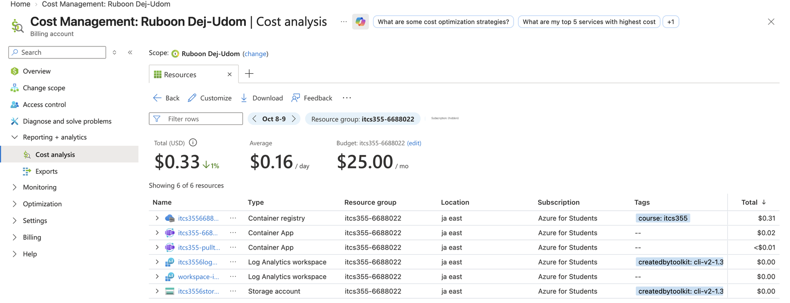

Teardown, performed after the last deploy:

- `ENDPOINT_NAME=itcs355-6688022-staging make teardown` deletes the tagged Azure ML jobs and compute and the staging Container App; the output is saved in `reports/lab4-teardown-log.txt`.
- The `regtest` app left over from Lab 3 was deleted.
- The drift schedule is switched off twice over: `DRIFT_ENABLED=false`, and the Drift workflow is disabled in the Actions tab, so nothing keeps invoking a deleted endpoint. The CD workflow is disabled after the final merge, so no later push can recreate the staging app.
- The Discord webhook was deleted, because its URL had been pasted into a chat during setup.

### Reproduce Lab 4 locally

```bash
make data && pytest -q tests/ && ruff check src/ service/ monitoring/ scripts/ tests/
python scripts/calibrate_drift_threshold.py --window 500 --trials 200      # threshold evidence
docker compose -f monitoring/docker-compose.yml up -d                       # Prometheus, Pushgateway, Grafana
MODEL_PATH=reports/deploy-model/model.joblib MODEL_VERSION=local-demo uvicorn service.app:app --port 8080 --workers 1
k6 run -e TARGET=http://127.0.0.1:8080/predict -e VUS=5 -e DURATION=60s loadtest/k6.js
python scripts/make_dataset.py --seed 5 --out data/fresh.csv
python scripts/make_window.py --source data/fresh.csv --n 500 --out data/window.csv
python scripts/inject_drift.py --source data/window.csv --out data/current.csv --feature temp_c --mode shift --magnitude 6
python -m monitoring.drift --current data/current.csv --threshold 0.09 --pushgateway localhost:9091
```

Open `http://localhost:3000` for the dashboard. Use one uvicorn worker: Prometheus counters are per process.
